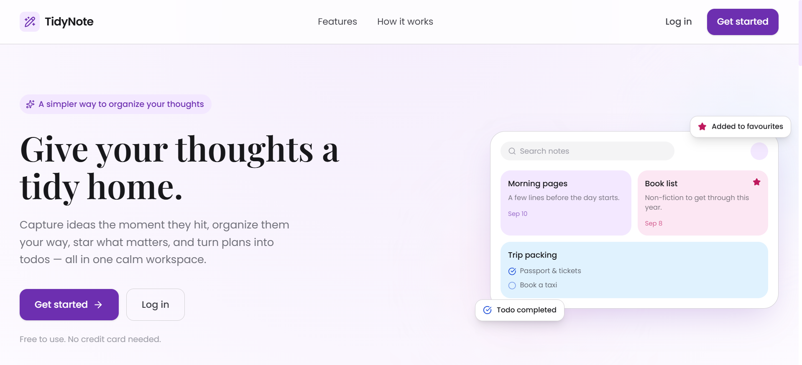
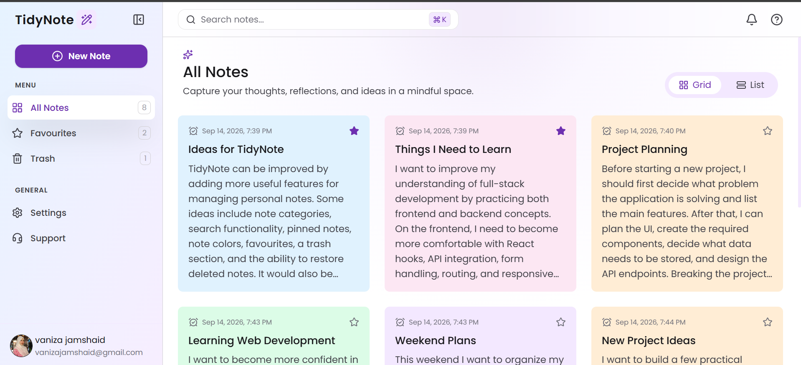
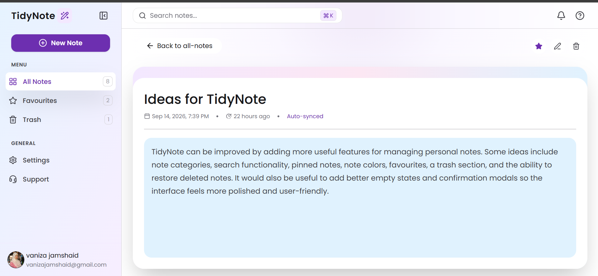
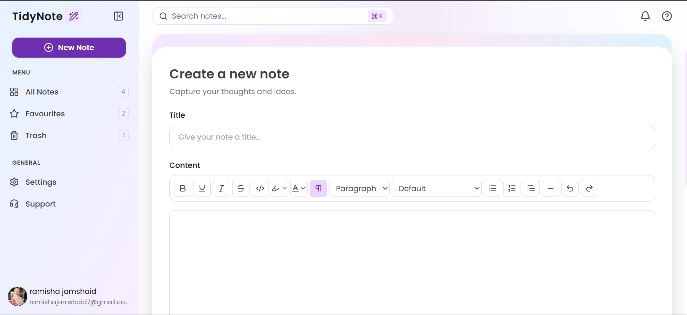

# TidyNote

TidyNote is a full-stack notes and productivity web application designed to make creating, organizing, and managing personal notes simple and convenient.

The project was built to practice and demonstrate full-stack web development using the MERN stack, including authentication, REST APIs, database operations, rich text editing, error handling, and a responsive React dashboard.

## Features

* User registration and login
* JWT-based authentication
* Access and refresh token handling
* Protected dashboard routes
* Create, read, update, and delete notes
* User-specific notes
* Favourite notes
* Trash/delete functionality
* Search notes
* Note colour customization
* Rich text note editing with Tiptap
* Note detail and edit pages
* Loading states during API operations
* Toast notifications for success and error feedback
* Client-side form validation
* API error handling
* Responsive dashboard interface
* REST API integration
* MongoDB data storage

## Screenshots

### Home Page


### Dashboard


### Note Detail


### Rich Text Editor



## Tech Stack

### Frontend

* React.js
* JavaScript
* Tailwind CSS
* React Router
* Axios
* Vite
* Tiptap
* Sonner
* Lucide React

### Backend

* Node.js
* Express.js
* REST APIs
* JWT Authentication
* Mongoose
* Cloudinary
* Multer
* Cookie-parser
* CORS

### Database

* MongoDB

### Tools

* Git
* GitHub

## Project Structure

The project is divided into separate frontend and backend applications.

```text
TidyNote/
├── frontend/
│   ├── src/
│   ├── public/
│   └── ...
│
├── backend/
│   ├── controllers/
│   ├── models/
│   ├── routes/
│   ├── middleware/
│   ├── utils/
│   └── ...
│
└── README.md
```

## Authentication

TidyNote uses JWT-based authentication to protect user-specific resources and dashboard routes.

The application uses access and refresh tokens to maintain authenticated sessions. Protected backend routes use authentication middleware to verify requests before allowing access to user-specific resources.

Authenticated users can manage their own notes, while unauthorized requests are restricted through protected routes and JWT verification.

## Notes Management

Users can create and manage their personal notes with features including:

* Note title and rich text content
* Custom note colours
* Favourite status
* Editing
* Deletion / trash
* Search
* User-specific note storage

Notes are associated with the authenticated user and stored in MongoDB.

## Rich Text Editor

TidyNote uses **Tiptap** to provide a rich text editing experience for notes.

The editor supports formatted note content and integrates with the note creation and editing workflow.

## User Feedback & Error Handling

TidyNote includes user-friendly feedback throughout the application.

### Loading States

Loading states are implemented for asynchronous operations such as:

* Login and registration
* Fetching notes
* Creating notes
* Updating notes
* Deleting notes
* Authentication requests

This provides visual feedback while API requests are being processed.

### Toast Notifications

The application uses **Sonner** for toast notifications to provide immediate feedback after user actions.

Examples include:

* Login successful
* Account created successfully
* Note created successfully
* Note updated successfully
* Note moved to trash
* Added to favourites
* Operation failed

### Error Handling

The frontend handles API and authentication errors and displays appropriate user-friendly messages instead of exposing raw server errors.

Form validation is also used to prevent invalid submissions before making API requests.

## API

The backend provides REST API endpoints for authentication and note management.

Example functionality includes:

```text
Authentication

- Register
- Login
- Logout
- Refresh Token

Notes

- Create Note
- Get Notes
- Update Note
- Delete Note
- Set Favourite
```

## Getting Started

### Prerequisites

Make sure you have the following installed:

* Node.js
* npm
* MongoDB

### Clone the Repository

```bash
git clone https://github.com/ramishajamshaid/TidyNote.git
cd TidyNote
```

### Install Dependencies

Install dependencies for both the frontend and backend.

```bash
cd frontend
npm install
```

Then:

```bash
cd ../backend
npm install
```

### Environment Variables

Create `.env` files for the frontend and backend and add the required environment variables.

Do not commit your `.env` files or expose API keys, database credentials, JWT secrets, or Cloudinary credentials.

### Run the Application

Start the backend server:

```bash
cd backend
npm run dev
```

Start the frontend development server in a separate terminal:

```bash
cd frontend
npm run dev
```

## What I Learned

Through TidyNote, I practiced:

* Building a full-stack MERN application
* Designing and consuming REST APIs
* Implementing JWT authentication
* Working with access and refresh tokens
* Working with MongoDB and Mongoose
* Building protected routes
* Implementing CRUD operations
* Managing user-specific data
* Integrating frontend and backend applications
* Building rich text editing functionality with Tiptap
* Handling asynchronous operations and loading states
* Implementing frontend and API error handling
* Using toast notifications for user feedback
* Creating responsive interfaces with React and Tailwind CSS
* Structuring a full-stack project

## Future Improvements

Possible future improvements include:

* Note pinning
* Sorting and filtering
* Improved search
* File or image attachments
* Better offline support
* Additional note organization features
* Deployment of the complete application

## Author

**Ramisha Jamshaid**

* GitHub: https://github.com/ramishajamshaid
* LinkedIn: https://linkedin.com/in/ramisha-jamshaid-9799b5412/
